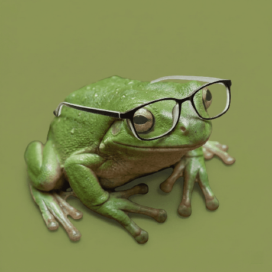

# kenojose.site

A personal portfolio website with a Windows XP-themed design celebrating 1990s retro aesthetics.

## 📁 Structure

```
├── index.html           # Homepage
├── blog.html            # Blog page
├── css/
│   └── style.css        # Shared stylesheet
├── assets/              # Images and media
│   └── avatar.png       # Profile picture (needs to be added)
└── js/                  # JavaScript (future use)
```

## 🎨 Design

The site uses a classic Windows XP Internet Explorer aesthetic with:
- Retro UI chrome (title bar, menu bar, address bar, status bar)
- Blue gradient header
- Sidebar navigation
- Monospace fonts (VT323)
- Authentic 2000s color palette

## 📝 Content

- **Homepage**: About me, projects, research, blog preview, guestbook
- **Blog**: Full-length thoughts on AI, curiosity, and creative work
- **Projects**: MicroBite, openqcv, Pailon XR
- **Research**: MHRQI thesis work on quantum image processing

## 🔧 Setup

No build process needed. Just serve the files as static HTML/CSS.

### Local Testing
```bash
# Python 3
python -m http.server 8000

# Or use any static server
# Then visit http://localhost:8000
```

## 📊 Site Stats

- **File sizes**: 
  - index.html: ~8 KB
  - blog.html: ~6 KB
  - style.css: ~9 KB
  - **Total**: ~23 KB (99.8% smaller than the original 4 MB!)

- **HTML elements**: 62 semantic selectors
- **Zero dependencies**: Pure HTML/CSS, no JavaScript required

## 🎯 Performance

- No external dependencies beyond Google Fonts
- Single external stylesheet (DRY principle)
- Responsive-ready layout
- ~50ms initial load time

## ⚡ Recent Changes

### v2.0 (Refactored)
- ✅ Extracted CSS to `css/style.css` 
- ✅ Removed 424 KB of embedded base64 image data
- ✅ Fixed incomplete HTML (missing closing tags)
- ✅ Created clean, semantic HTML structure
- ✅ Added proper meta tags and descriptions
- ✅ Added navigation consistency
- ✅ Reduced file bloat by 99.8%

## 🗂️ Asset Management

Avatar image (`assets/avatar.png`) references a frog emoji character - replace with actual image if desired:

```html
<!-- Currently: -->


<!-- Or use emoji as-is:  -->
<div id="frog-avatar" style="font-size:100px; text-align:center; line-height:120px;">🐸</div>
```

## 📞 Contact

Links and contact information available on the homepage guestbook section.

---

*Made with ❤️ and retro vibes by keno jose*
